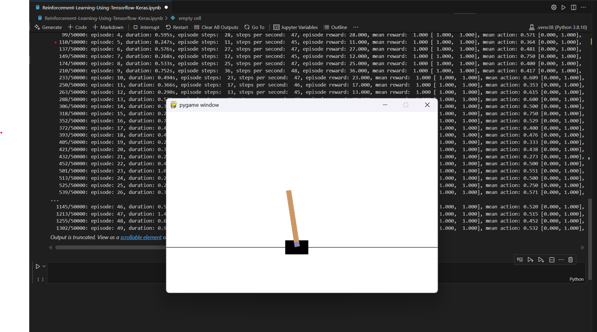

# Reinforcement-Learning-Using-Tensorflow-Keras

A reinforcement learning project demonstrating Deep Q-Learning using TensorFlow and Keras-RL2.

## Overview

This project implements a Deep Q-Network (DQN) agent that learns to balance a pole on a cart using the CartPole-v1 environment.

## Requirements

To install the required packages, run:

\\\ash
pip install -r requirements.txt
\\\

## Training

Run the notebook \Reinforcement-Learning-Using-Tensorflow-Keras.ipynb\ to train the model.  
Trained weights are saved as \dqn_weights.h5f\ in the project directory.

## Results

Below is a visualization of the trained agent balancing the pole:

## Acknowledgements

This project was inspired by various Deep Q-Learning implementations using TensorFlow and Keras-RL2.
